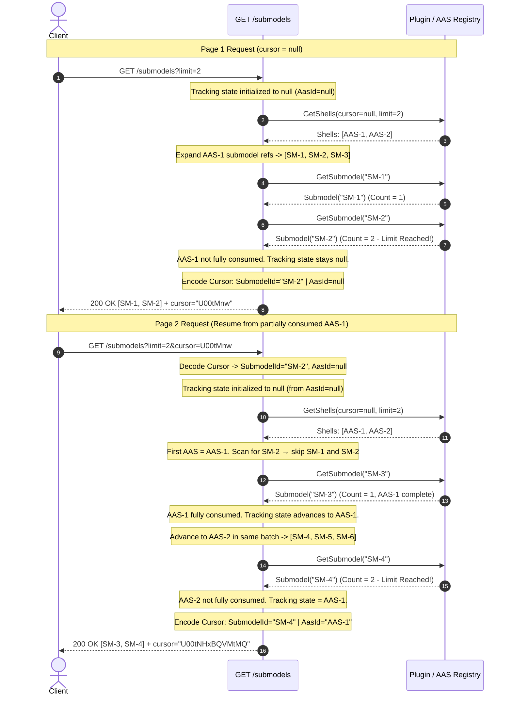

# Submodel Pagination Cursor Concept - Get All Submodels

## Problem
The DataEngine's `GET /submodels` and `GET /submodel-descriptors` endpoints must paginate **submodels**, but the underlying Plugin APIs paginate **products (Asset Administration Shells / AAS IDs)**. In an Asset Administration Shell ecosystem, a single product (AAS) can contain multiple submodels (a `1-to-N` expansion relationship). 

When a client requests a page of submodels with a specific `limit` (e.g., `limit=2` or `limit=100`), a single product's submodel list may be only **partially consumed** when the page limit is reached. If the pagination engine uses standard single-field or exclusive cursor pagination (which moves the underlying Plugin cursor past the product), any remaining uncollected submodels in that product are permanently skipped on subsequent page requests. 

## Constraints
- **O(limit) Memory Footprint:** The pagination engine must operate with constant memory proportional to the requested page `limit` and batch size, never loading the full dataset into memory.
- **No Plugin API Modifications:** Underlying Plugins implement standard IDTA / BaSyx product-level cursor pagination (`limit` and `cursor`); Plugins do not support submodel-level cursors.
- **AAS-ID-Based Exclusive Plugin Cursor:** The Plugin cursor is AAS-ID-based and uses exclusive semantics - passing an AAS ID as cursor instructs the Plugin to return all AAS strictly after that ID in its deterministic ordering.
- **Deterministic Ordering:** Plugins return products in stable, deterministic order, and submodel references within a product maintain a deterministic order.
- **Zero Data Loss / Zero Duplication:** Traversing all pages from start to finish must yield every submodel exactly once under static conditions.
- **IDTA Compliance:** The pagination solution must remain fully compliant with the IDTA AAS Part 2 API specification. The DataEngine may introduce internal pagination logic and cursor management, but the externally exposed API behavior, request/response contracts must remain compliant with the IDTA specification.

## Assumptions
- Each Asset Administration Shell (`IAssetAdministrationShell`) has a unique `ID` and a deterministic list of submodel references (`Submodels`).
- The API endpoint acts as the orchestrator over one or more external Plugin instances.
- Submodel data is collected on-demand after identifying candidate submodel IDs from shell templates.

---

## Considered Alternatives

### 1. Submodel ID Cursor with Unbounded Plugin Fetching (No Plugin Limit/Cursor)
- **Description:** Store only the last delivered `SubmodelId` in the client cursor token (`cursor = LastSubmodelId`). When fetching products from the Plugin (AAS Shell request), the DataEngine does **not** provide any `limit` or `cursor` to the Plugin, thereby fetching **all products (shells)** on every page request. During submodel expansion, the DataEngine iterates through all products and submodels from the beginning, skipping submodels until it matches the requested `SubmodelId` cursor, and then collects the next page of submodels up to `limit`.
- **Pros:**
  - Very simple and compact cursor token (only a single `SubmodelId`).
  - Correctness is maintained (no submodels are skipped or lost across page boundaries, as all products are inspected).
  - No complex multi-field cursor coordinate tracking required.
- **Cons:**
  - **High Upstream Overload & Network Waste:** Fetching *all* products from the Plugin on *every single page request* destroys scalability. If there are 100,000 products, every page request fetches all 100,000 products from the Plugin just to find where `SubmodelId` is located.

### 2. Product ID Bulk Endpoint in Plugin with DataEngine Expansion
- **Description:** Introduce a new bulk endpoint in the Plugin contract to retrieve all product IDs (or a paginated list of all product IDs). The DataEngine would retrieve these product IDs, resolve the shell template for each ID to determine the associated submodels, and then query the Plugin for the specific submodel data. Under this approach, the client cursor only needs to store the last delivered `SubmodelId`.
- **Pros:**
  - **Simple Cursor Token:** The pagination cursor remains simple (e.g., just the last delivered `SubmodelId` or index).
- **Cons:**
  - **Plugin Contract Breaking Change:** Requires updating the Plugin API contract to support the new bulk product ID endpoint.
  - **High Architectural Complexity:** Orchestrating product ID retrieval, resolving matching shell templates, and mapping them to submodels on the fly in the DataEngine introduces significant complexity and state tracking.
  - **Association / Resolution Difficulties:** It is difficult to map a product ID directly to its associated shell template and submodels without fetching the entire shell, which negates the performance benefits.


### 3. Two-Field Composite Cursor (`SubmodelId` | `AasId`) (Chosen)
- **Description:** The cursor stores exactly two lightweight coordinates: the last submodel ID delivered to the client (`SubmodelId`) and the AAS ID that serves simultaneously as both the position anchor and the next plugin request cursor (`AasId`). Because the plugin cursor is AAS-ID-based with exclusive semantics, the engine can derive the exact plugin request cursor directly from the AAS ID stored in the DataEngine cursor. A single tracking state - initialized from the cursor's `AasId` field and advanced each time an AAS is fully consumed - determines which AAS to start from on every plugin request. This eliminates the need for a separate opaque plugin cursor field.
- **Pros:**
  - **Guaranteed Correctness:** Eliminates data loss and duplication; fully supports `1-to-N` expansion.
  - **Minimal Cursor Size:** Exactly 2 pipe-delimited string fields, smaller than a 3-field cursor.
  - **Constant Memory (`O(limit)`):** Streams and collects only what is needed for the current page.
  - **No Plugin API Changes Required:** Works seamlessly over AAS-ID-based exclusive cursor endpoints.
  - **Bounded Skip Scan:** The `SubmodelId` skip scan is confined to the first AAS of the returned batch only, never scanning the full dataset.

---

### Alternative Comparison Summary

| Approach | Memory Footprint | Correctness (No Data Loss) | Cursor Token Size | Plugin API Changes Required |
|---|---|---|---|---|
| **1. Submodel ID Cursor (Unbounded Fetch)** | `O(N)` (Unbounded Fetch) | Yes | Small (`SubmodelId`) | No |
| **2. Product ID Bulk Endpoint** | `O(N)` (Unbounded Fetch of IDs) | Yes | Small (`SubmodelId`) | **Yes** |
| **3. Two-Field Composite Cursor (Chosen)** | `O(limit)` (Optimal) | **Yes** | **Smallest (2 fields)** | No |

---

## Decision
We adopt **Option 3: Two-Field Composite Cursor (`SubmodelId` | `AasId`)** as the standard architectural pattern for all submodel and submodel-descriptor pagination.

---

## Architectural Concept & Two-Field Composite Cursor

### 1. The `1-to-N` Expansion Problem (`limit=2` Walkthrough)

Consider an environment with 3 products (`AAS-1`, `AAS-2`, `AAS-3`), each containing 3 submodels:
```
Product 1 (AAS-1)         Product 2 (AAS-2)         Product 3 (AAS-3)
├── SM-1                  ├── SM-4                  ├── SM-7
├── SM-2                  ├── SM-5                  ├── SM-8 
└── SM-3                  ├── SM-6                  └── SM-9
```

When a client executes `GET /submodels?limit=2`:
```
Page 1: GET /submodels?limit=2

  1. API calls Plugin.GetShells(cursor=null) → returns [AAS-1, AAS-2]
  2. Expand AAS-1 → [SM-1, SM-2, SM-3]
  3. Collect SM-1 (Count=1), Collect SM-2 (Count=2). Page limit reached!
  4. AAS-1 is PARTIALLY consumed (SM-3 is still pending).
```

If the API were to advance the Plugin cursor past AAS-1 for Page 2:
```
Page 2: GET /submodels?limit=2&cursor="AAS-1" (exclusive - starts after AAS-1)

  1. API calls Plugin.GetShells(cursor="AAS-1")
  2. Plugin returns products AFTER AAS-1 → [AAS-2, AAS-3, ...]
  3. RESULT: SM-3 (from AAS-1) IS PERMANENTLY LOST!
```

The cursor must not advance the Plugin cursor until the current AAS is fully consumed.

### 2. Logical Composition of the Two-Field Cursor

The cursor stores two coordinates that together capture exact positioning across both the AAS layer and the Submodel layer:

| Coordinate | Wire Field Position | Nullable | Description |
|---|---|---|---|
| `SubmodelId` | Index 0 (Prefix) | Yes (`null` when limit is reached exactly at an AAS boundary) | The unique identifier of the last submodel delivered to the client. On resume, the API scans only the **first AAS** of the returned batch to skip already-delivered submodels. |
| `AasId` | Index 1 (Suffix) | Yes (`null` on first page or when no AAS has been fully consumed) | The AAS ID that is passed directly to the Plugin as an exclusive cursor on resume. The Plugin returns all AAS strictly after this ID. Advances only when an AAS is fully consumed. |

#### Wire Encoding Strategy
The logical cursor string is formatted as UTF-8 text separated by a pipe character (`|`), then encoded using standard `Base64Url` encoding (RFC 4648) without padding:
```
Logical Structure:  {SubmodelId}|{AasId}
Encoded Wire Token: Base64Url( UTF-8( "{SubmodelId}|{AasId}" ) )
```

**Examples:**
- Mid-AAS cursor, no AAS yet fully consumed (re-fetch from plugin start):
  - Logical: `SM-2|`  (AasId is empty/null)
  - Encoded: `U00tMnw`
- Mid-AAS cursor, AAS-1 was fully consumed (plugin starts after AAS-1):
  - Logical: `SM-4|AAS-1`
  - Encoded: `U00tNHxBQVMtMQ`
- Limit reached at AAS boundary, AAS-2 fully consumed (plugin starts after AAS-2):
  - Logical: `|AAS-2`  (SubmodelId is empty/null)
  - Encoded: `fEFBUy0y`

### 3. The AasId Tracking Logic

A single position-tracking state drives the cursor throughout a page execution. It is:
- **Initialized** from the incoming cursor's `AasId` field (null at the very first request).
- **Advanced** each time an AAS within the current batch is fully consumed - it is updated to that AAS's ID.
- **Captured** as the `AasId` field of the output cursor when the page limit is reached.

This guarantees the following invariant: the `AasId` in the output cursor always equals the ID of the **last fully consumed AAS at the moment the page limit was reached**, or null if no AAS was fully consumed since the current plugin batch started. On the next request, the API passes this `AasId` directly to the Plugin as an exclusive cursor, which returns all AAS strictly after that ID - precisely the position where collection should resume.

When the page limit is reached **exactly at the boundary of an AAS** (i.e., the last submodel of that AAS is the last one collected): the AAS is considered fully consumed, the tracking state advances to that AAS's ID, and `SubmodelId` is set to null. On resume, the API collects from the very first submodel of the first AAS returned by the Plugin.

### 4. Resume Algorithm (Conceptual)

On receiving a non-null cursor:
1. Extract `SubmodelId` and `AasId` from the cursor.
2. Initialize the tracking state from `AasId`.
3. Call the Plugin with the tracking state as the exclusive cursor → receives the first relevant batch.
4. In the **first AAS of the batch**:
   - If `SubmodelId` is set: scan this AAS to find `SubmodelId`, skip everything up to and including it, and begin collecting from the next submodel.
   - If `SubmodelId` is null: collect from the very first submodel.
5. For all subsequent AAS in the same batch, and for further batches: collect all submodels from their start.
6. Each time an AAS is fully consumed, advance the tracking state to that AAS's ID.
7. When the page limit is reached: encode the output cursor as `{SubmodelId=last_collected, AasId=current_tracking_state}`. If the limit was reached exactly at an AAS boundary: encode as `{SubmodelId=null, AasId=that_AAS_ID}`.
8. When a batch is exhausted without reaching the page limit: request the next batch from the Plugin using the current tracking state as the exclusive cursor.

The `SubmodelId` skip scan is always bounded to the **first AAS of the batch** - never a full dataset scan - because `AasId` guarantees the Plugin skips all previously fully consumed AAS before returning the batch.

---

## Sequence Diagram

The following sequence diagram illustrates the end-to-end execution flow of `GET /submodels?limit=2` across two page requests, demonstrating how the tracking state advances when an AAS is fully consumed and how the two-field cursor drives the next Plugin request. The API endpoint handles pagination logic directly - no intermediate service layer is involved:



On Page 3, the API calls `Plugin.GetShells(cursor="AAS-1")` - the Plugin returns `[AAS-2, AAS-3]` (all AAS strictly after `AAS-1`). The API scans `AAS-2` (the first AAS in the new batch) to find `SM-4`, skips it, and resumes collection from `SM-5`.

---

## Step-by-Step Examples

### Example 1: `limit=2` Across 5 Consecutive Pages (The Tricky Case)

Dataset:
- `AAS-1` → `[SM-1, SM-2, SM-3]`
- `AAS-2` → `[SM-4, SM-5, SM-6]`
- `AAS-3` → `[SM-7, SM-8, SM-9]`

Plugin batch size: 2 products per request.

#### Page 1: `GET /submodels?limit=2`
- **Request:** `limit=2`, `cursor=null`
- **API Execution:**
  1. Tracking state initialized to null.
  2. Call `Plugin.GetShells(cursor=null)` → returns `[AAS-1, AAS-2]`.
  3. First AAS is `AAS-1`. `SubmodelId` is null (no cursor) → collect from the start.
  4. Collect `SM-1` (Count=1), `SM-2` (Count=2) → **Limit reached!** `AAS-1` is partial.
  5. Tracking state unchanged (null). No AAS was fully consumed.
  6. Encode cursor: `SubmodelId="SM-2"`, `AasId=null`.
- **Response:**
```json
{ "paging_metadata": { "cursor": "U00tMnw" }, "result": [{ "id": "SM-1" }, { "id": "SM-2" }] }
```

#### Page 2: `GET /submodels?limit=2&cursor=U00tMnw`
- **Request:** `limit=2`, cursor decodes to `SubmodelId="SM-2"`, `AasId=null`
- **API Execution:**
  1. Tracking state initialized to null (from `AasId=null`).
  2. Call `Plugin.GetShells(cursor=null)` → returns `[AAS-1, AAS-2]`.
  3. First AAS is `AAS-1`. Scan for `SM-2` → skip `SM-1`, `SM-2`. Collect `SM-3` (Count=1). `AAS-1` complete.
  4. Tracking state advances to `AAS-1`.
  5. Advance to `AAS-2` in the same batch. Collect `SM-4` (Count=2) → **Limit reached!** `AAS-2` is partial.
  6. Tracking state = `AAS-1`. Encode cursor: `SubmodelId="SM-4"`, `AasId="AAS-1"`.
- **Response:**
```json
{ "paging_metadata": { "cursor": "U00tNHxBQVMtMQ" }, "result": [{ "id": "SM-3" }, { "id": "SM-4" }] }
```

#### Page 3: `GET /submodels?limit=2&cursor=U00tNHxBQVMtMQ`
- **Request:** `limit=2`, cursor decodes to `SubmodelId="SM-4"`, `AasId="AAS-1"`
- **API Execution:**
  1. Tracking state initialized to `AAS-1` (from `AasId="AAS-1"`).
  2. Call `Plugin.GetShells(cursor="AAS-1")` → returns `[AAS-2, AAS-3]` (all AAS strictly after `AAS-1`).
  3. First AAS is `AAS-2`. Scan for `SM-4` → skip `SM-4`. Collect `SM-5` (Count=1), `SM-6` (Count=2) → **Limit reached!** `AAS-2` is fully consumed at the limit boundary.
  4. Tracking state advances to `AAS-2`. Since `AAS-2` is fully consumed at the boundary, `SubmodelId=null`.
  5. Encode cursor: `SubmodelId=null`, `AasId="AAS-2"`.
- **Response:**
```json
{ "paging_metadata": { "cursor": "fEFBUy0y" }, "result": [{ "id": "SM-5" }, { "id": "SM-6" }] }
```

#### Page 4: `GET /submodels?limit=2&cursor=fEFBUy0y`
- **Request:** `limit=2`, cursor decodes to `SubmodelId=null`, `AasId="AAS-2"`
- **API Execution:**
  1. Tracking state initialized to `AAS-2` (from `AasId="AAS-2"`).
  2. Call `Plugin.GetShells(cursor="AAS-2")` → returns `[AAS-3]` (all AAS strictly after `AAS-2`).
  3. First AAS is `AAS-3`. `SubmodelId` is null → collect from the start.
  4. Collect `SM-7` (Count=1), `SM-8` (Count=2) → **Limit reached!** `AAS-3` is partial.
  5. Tracking state unchanged (`AAS-2`). Encode cursor: `SubmodelId="SM-8"`, `AasId="AAS-2"`.
- **Response:**
```json
{ "paging_metadata": { "cursor": "U00tOHxBQVMtMg" }, "result": [{ "id": "SM-7" }, { "id": "SM-8" }] }
```

#### Page 5 (Final): `GET /submodels?limit=2&cursor=U00tOHxBQVMtMg`
- **Request:** `limit=2`, cursor decodes to `SubmodelId="SM-8"`, `AasId="AAS-2"`
- **API Execution:**
  1. Tracking state initialized to `AAS-2`.
  2. Call `Plugin.GetShells(cursor="AAS-2")` → returns `[AAS-3]`.
  3. First AAS is `AAS-3`. Scan for `SM-8` → skip `SM-7`, `SM-8`. Collect `SM-9` (Count=1).
  4. `AAS-3` exhausted. No more batches (`nextCursor=null`). Dataset exhausted.
  5. Return with `cursor=null`.
- **Response:**
```json
{ "paging_metadata": { "cursor": null }, "result": [{ "id": "SM-9" }] }
```

---

### Example 2: `limit=4` Across 3 Pages

#### Page 1: `GET /submodels?limit=4`
- **Execution:** Tracking state=null. Plugin(null) → [AAS-1, AAS-2]. Collect all 3 of AAS-1 (tracking advances to AAS-1), then collect SM-4 from AAS-2 (limit reached, AAS-2 partial).
- **Response Cursor:** `SubmodelId="SM-4"`, `AasId="AAS-1"` (encoded: `U00tNHxBQVMtMQ`)
- **Result:** `[SM-1, SM-2, SM-3, SM-4]`

#### Page 2: `GET /submodels?limit=4&cursor=U00tNHxBQVMtMQ`
- **Execution:** Tracking state=AAS-1. Plugin(AAS-1) → [AAS-2, AAS-3]. Scan AAS-2 for SM-4, skip it, collect SM-5, SM-6 (AAS-2 done, tracking → AAS-2). Advance to AAS-3, collect SM-7, SM-8 (Count=4, limit reached, AAS-3 partial).
- **Response Cursor:** `SubmodelId="SM-8"`, `AasId="AAS-2"` (encoded: `U00tOHxBQVMtMg`)
- **Result:** `[SM-5, SM-6, SM-7, SM-8]`

#### Page 3: `GET /submodels?limit=4&cursor=U00tOHxBQVMtMg`
- **Execution:** Tracking state=AAS-2. Plugin(AAS-2) → [AAS-3]. Scan AAS-3 for SM-8, skip SM-7, SM-8, collect SM-9 (Count=1). Dataset exhausted.
- **Response Cursor:** `null`
- **Result:** `[SM-9]`

---
