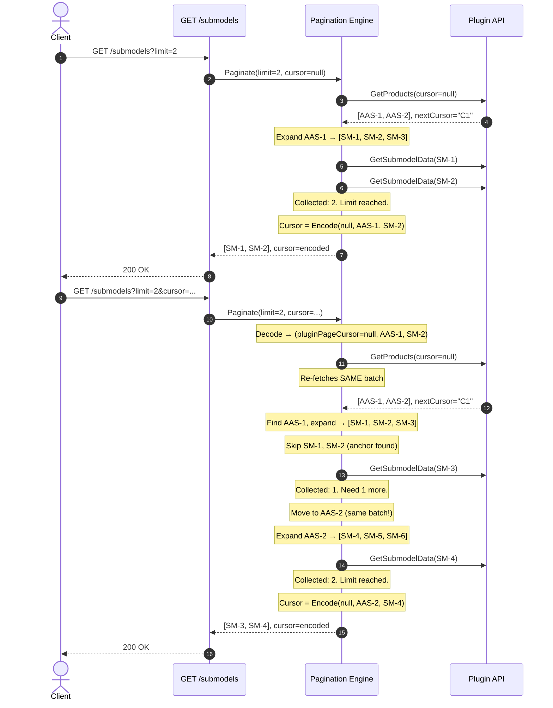

# Submodel Pagination Cursor Design - Get All Submodels

## 1. Problem Statement

The DataEngine's `GET /submodels` endpoint must paginate **submodels**, but the underlying Plugin API paginates **products (AAS IDs)**. A single product may contain multiple submodels, and a product can be only **partially consumed** within one response page. The cursor must encode enough state to resume mid-product without duplicating or skipping submodels.

---

## 2. Data Model

```
Product 1 (AAS-1)         Product 2 (AAS-2)         Product 3 (AAS-3)
├── SM-1                  ├── SM-4                  ├── SM-7
├── SM-2                  ├── SM-5                  ├── SM-8
└── SM-3                  ├── SM-6                  └── SM-9
```

- **3 products**, each with **3 submodels** → **9 submodels** total.
- Plugin returns products in a stable, deterministic order.
- Submodel IDs within a product are derived from Shell Templates and maintain a deterministic order.

---

## 3. The Limit=2 Problem (Why a Simple Two-Field Cursor Fails)

Consider `limit=2` with our example data:

```
Page 1: GET /submodels?limit=2

  Expand AAS-1 → [SM-1, SM-2, SM-3]
  Collect SM-1, SM-2. Limit reached.
  Cursor = (AAS-1, SM-2)   ← AAS-1 is PARTIALLY consumed (SM-3 still pending)

Page 2: GET /submodels?limit=2&cursor=(AAS-1, SM-2)

  Need to resume inside AAS-1 to get SM-3.
  But Plugin cursor semantics are EXCLUSIVE: passing AAS-1 returns [AAS-2, AAS-3, ...]
  SM-3 is LOST!
```

**Root cause:** The Plugin's cursor-based pagination uses exclusive semantics ("give me items AFTER this cursor"). Once the Plugin moves past a product, there's no way to go back using the Plugin's pagination API alone.

**The partially consumed product must be handled independently from the Plugin's forward pagination.**

---

## 4. Cursor Structure (Two-Field Composite)

### 4.1 Logical Composition

The cursor requires **two** coordinates:

| Field | Type | Purpose |
|-------|------|---------|
| `SubmodelId` | string | The last submodel ID **included** in the previous response. Marks the exact resume point within the product. |
| `AasId` | string | The AAS ID that serves simultaneously as the position anchor and the exclusive plugin request cursor. |

### 4.2 Why Two Fields?

| Scenario | What's needed |
|----------|--------------|
| Product partially consumed | `AasId` to re-expand the product on the first batch; `SubmodelId` to skip delivered items |
| Exclusive plugin request | `AasId` is passed directly as the exclusive plugin cursor (`trackingAasId`) to continue forward |

### 4.3 Wire Format

```
Logical:    {SubmodelId}|{AasId}
Encoded:    Base64Url( UTF-8( "{SubmodelId}|{AasId}" ) )
```

**Example:**

```
Logical:    https://example.com/submodels/Nameplate|https://example.com/shells/001
Encoded:    aHR0cHM6Ly9leGFtcGxlLmNvbS9zdWJtb2RlbHMvTmFtZXBsYXRlfGh0dHBzOi8vZXhhbXBsZS5jb20vc2hlbGxzLzAwMQ==
```

The cursor is **opaque** to the client - they never parse or construct it.

### 4.4 Special Cases

| Scenario | Cursor Value |
|----------|-------------|
| First page (no cursor) | `null` / absent |
| Last page (no more data) | Response returns `cursor = null` (signals end of dataset) |
| Limit reached mid-product or at boundary | `{LastSubmodelId}|{CurrentAasId}` |
---

## 5. Pagination Algorithm

### 5.1 Two-Phase Resume Strategy

The key insight: **on resume, the partially consumed product is handled FIRST (Phase 1) using only its AAS ID, THEN forward pagination continues (Phase 2) using the Plugin's next cursor.**

```
┌────────────────────────────────────────────────────────────────────────┐
│  PHASE 1: Complete the partially consumed product                      │
│                                                                        │
│  - Re-derive submodel IDs for CurrentAasId (via template expansion)    │
│  - Skip submodels up to and including LastSubmodelId                   │
│  - Collect remaining submodels until limit or product exhausted        │
│                                                                        │
│  NO Plugin pagination call needed - we already know the AAS ID.        │
├────────────────────────────────────────────────────────────────────────┤
│  PHASE 2: Continue with next products (if limit not yet reached)       │
│                                                                        │
│  - Call Plugin.GetProducts(cursor = PluginNextCursor)                  │
│  - Expand each returned product's submodels                            │
│  - Collect until limit reached or Plugin exhausted                     │
└────────────────────────────────────────────────────────────────────────┘
```

### 5.2 Plugin Cursor Coordination

```
┌───────────────────────────────────────────────────────────────────────────┐
│  Page 1: GET /submodels?limit=2                                           │
│                                                                           │
│  Engine calls Plugin: GetProducts(limit=2, cursor=null)                   │
│  Plugin returns: [AAS-1, AAS-2], pluginNextCursor = "C1"                  │
│                                                                           │
│  Expand AAS-1 → [SM-1, SM-2, SM-3]                                        │
│  Collect SM-1, SM-2. Limit reached.                                       │
│                                                                           │
│  Cursor = Encode("C1", "AAS-1", "SM-2")                                   │
│                    ▲       ▲         ▲                                    │
│                    │       │         └── Last delivered submodel          │
│                    │       └──────────── Product still being consumed     │
│                    └─────────────────── Plugin cursor for NEXT products   │
│                                         (skips AAS-1 and AAS-2)           │
├───────────────────────────────────────────────────────────────────────────┤
│  Page 2: Resume with cursor ("C1", "AAS-1", "SM-2")                       │
│                                                                           │
│  PHASE 1: Re-expand AAS-1 → [SM-1, SM-2, SM-3]                            │
│            Skip SM-1, SM-2. Collect SM-3. Count = 1.                      │
│                                                                           │
│  PHASE 2: Need 1 more. But wait - AAS-2 was in the same Plugin page!      │
│            We need AAS-2 before using "C1".                               │
│              SEE SECTION 5.4 FOR HANDLING THIS                            │
└───────────────────────────────────────────────────────────────────────────┘
```

### 5.3 The "Same-Page Products" Problem & Solution

When the Plugin returns `[AAS-1, AAS-2]` with `nextCursor = "C1"`:
- `"C1"` skips **both** AAS-1 and AAS-2.
- But if we only consumed AAS-1 partially, AAS-2 hasn't been processed at all!

**Solution: Store the Plugin cursor that produced the current batch, not the "next" cursor.**

Revised cursor structure:

| Field | Purpose |
|-------|---------|
| `PluginPageCursor` | The cursor that was used to **fetch the current batch** (null for the first page). On resume, re-fetch the same batch from the Plugin. |
| `CurrentAasId` | The partially consumed product's AAS ID. |
| `LastSubmodelId` | Last delivered submodel within that product. |

### 5.4 Why Store `PluginPageCursor` (Not `PluginNextCursor`)

| Stored Value | On Resume | Problem |
|---|---|---|
| `PluginNextCursor` | Gets products AFTER current batch | Products between `currentAasId` and end of batch are LOST |
| **`PluginPageCursor`** | **Re-fetches the same batch** | **All products in the batch are available; skip already-consumed ones** |

The trade-off: on resume, we re-fetch and re-scan some products we've already processed. But:
- The re-scan is bounded (one Plugin page, typically small).
- Correctness is guaranteed - no submodels are ever lost.
- No extra Plugin endpoints required.

---

## 6. Request/Response Examples

### 6.1 Example: `limit=2` (The Tricky Case)

**Page 1 - `GET /submodels?limit=2`**

```
1. No cursor → pluginPageCursor = null, no skipping.
2. Call Plugin: GetProducts(cursor=null) → [AAS-1, AAS-2], nextPluginCursor="C1"
3. Expand AAS-1 → [SM-1, SM-2, SM-3]
4. Collect SM-1. Count=1.
5. Collect SM-2. Count=2. Limit reached.
6. Cursor = Encode(pluginPageCursor=null, AasId="AAS-1", LastSM="SM-2")
```

```json
{
  "result": [
    { "id": "SM-1" },
    { "id": "SM-2" }
  ],
  "paging_metadata": { "cursor": "fEFBUy0xfFNNLTI=" }
}
```

---

**Page 2 - `GET /submodels?limit=2&cursor=fEFBUy0xfFNNLTI=`**

```
1. Decode cursor → (pluginPageCursor=null, currentAasId="AAS-1", lastSM="SM-2")
2. Call Plugin: GetProducts(cursor=null) → [AAS-1, AAS-2], nextPluginCursor="C1"
   (Same call as Page 1 - re-fetches the same batch)
3. Skip products before AAS-1: none to skip.
4. Expand AAS-1 → [SM-1, SM-2, SM-3]
5. Skip submodels up to and including SM-2.
6. Collect SM-3. Count=1.
7. Move to AAS-2 (next product in SAME batch).
8. Expand AAS-2 → [SM-4, SM-5, SM-6]
9. Collect SM-4. Count=2. Limit reached.
10. Cursor = Encode(pluginPageCursor=null, AasId="AAS-2", LastSM="SM-4")
```

```json
{
  "result": [
    { "id": "SM-3" },
    { "id": "SM-4" }
  ],
  "paging_metadata": { "cursor": "fEFBUy0yfFNNLTQ=" }
}
```

---

**Page 3 - `GET /submodels?limit=2&cursor=fEFBUy0yfFNNLTQ=`**

```
1. Decode cursor → (pluginPageCursor=null, currentAasId="AAS-2", lastSM="SM-4")
2. Call Plugin: GetProducts(cursor=null) → [AAS-1, AAS-2], nextPluginCursor="C1"
3. Skip products before AAS-2: skip AAS-1.
4. Expand AAS-2 → [SM-4, SM-5, SM-6]
5. Skip submodels up to and including SM-4.
6. Collect SM-5. Count=1.
7. Collect SM-6. Count=2. Limit reached.
8. Cursor = Encode(pluginPageCursor=null, AasId="AAS-2", LastSM="SM-6")
```

```json
{
  "result": [
    { "id": "SM-5" },
    { "id": "SM-6" }
  ],
  "paging_metadata": { "cursor": "fEFBUy0yfFNNLTY=" }
}
```

---

**Page 4 - `GET /submodels?limit=2&cursor=fEFBUy0yfFNNLTY=`**

```
1. Decode cursor → (pluginPageCursor=null, currentAasId="AAS-2", lastSM="SM-6")
2. Call Plugin: GetProducts(cursor=null) → [AAS-1, AAS-2], nextPluginCursor="C1"
3. Skip products before AAS-2: skip AAS-1.
4. Expand AAS-2 → [SM-4, SM-5, SM-6]
5. Skip SM-4, SM-5, SM-6 (all skipped - product fully consumed).
6. No more products in this batch.
7. Move to next Plugin page: GetProducts(cursor="C1") → [AAS-3], nextPluginCursor=null
8. Expand AAS-3 → [SM-7, SM-8, SM-9]
9. Collect SM-7. Count=1.
10. Collect SM-8. Count=2. Limit reached.
11. Cursor = Encode(pluginPageCursor="C1", AasId="AAS-3", LastSM="SM-8")
```

```json
{
  "result": [
    { "id": "SM-7" },
    { "id": "SM-8" }
  ],
  "paging_metadata": { "cursor": "QzF8QUFTLTN8U00tOA==" }
}
```

---

**Page 5 (Final) - `GET /submodels?limit=2&cursor=QzF8QUFTLTN8U00tOA==`**

```
1. Decode cursor → (pluginPageCursor="C1", currentAasId="AAS-3", lastSM="SM-8")
2. Call Plugin: GetProducts(cursor="C1") → [AAS-3], nextPluginCursor=null
3. Skip products before AAS-3: none.
4. Expand AAS-3 → [SM-7, SM-8, SM-9]
5. Skip SM-7, SM-8.
6. Collect SM-9. Count=1.
7. No more products, no more plugin pages.
8. End of dataset → cursor = null.
```

```json
{
  "result": [
    { "id": "SM-9" }
  ],
  "paging_metadata": { "cursor": null }
}
```

---

### 6.2 Example: `limit=4`

**Page 1 - `GET /submodels?limit=4`**

```
1. Call Plugin: GetProducts(cursor=null) → [AAS-1, AAS-2, AAS-3], nextPluginCursor=null
2. Expand AAS-1 → [SM-1, SM-2, SM-3]. Collect all. Count=3.
3. Expand AAS-2 → [SM-4, SM-5, SM-6]. Collect SM-4. Count=4. Limit reached.
4. Cursor = Encode(pluginPageCursor=null, AasId="AAS-2", LastSM="SM-4")
```

```json
{
  "result": [
    { "id": "SM-1" },
    { "id": "SM-2" },
    { "id": "SM-3" },
    { "id": "SM-4" }
  ],
  "paging_metadata": { "cursor": "fEFBUy0yfFNNLTQ=" }
}
```

**Page 2 - `GET /submodels?limit=4&cursor=fEFBUy0yfFNNLTQ=`**

```
1. Decode → (pluginPageCursor=null, currentAasId="AAS-2", lastSM="SM-4")
2. Call Plugin: GetProducts(cursor=null) → [AAS-1, AAS-2, AAS-3], nextPluginCursor=null
3. Skip AAS-1 (before AAS-2).
4. Expand AAS-2 → [SM-4, SM-5, SM-6]. Skip SM-4. Collect SM-5, SM-6. Count=2.
5. Expand AAS-3 → [SM-7, SM-8, SM-9]. Collect SM-7, SM-8. Count=4. Limit reached.
6. Cursor = Encode(pluginPageCursor=null, AasId="AAS-3", LastSM="SM-8")
```

```json
{
  "result": [
    { "id": "SM-5" },
    { "id": "SM-6" },
    { "id": "SM-7" },
    { "id": "SM-8" }
  ],
  "paging_metadata": { "cursor": "fEFBUy0zfFNNLTg=" }
}
```

**Page 3 (Final) - `GET /submodels?limit=4&cursor=fEFBUy0zfFNNLTg=`**

```
1. Decode → (pluginPageCursor=null, currentAasId="AAS-3", lastSM="SM-8")
2. Call Plugin: GetProducts(cursor=null) → [AAS-1, AAS-2, AAS-3]
3. Skip AAS-1, AAS-2. Find AAS-3.
4. Expand AAS-3 → [SM-7, SM-8, SM-9]. Skip SM-7, SM-8. Collect SM-9. Count=1.
5. No more products. Plugin exhausted.
6. cursor = null.
```

```json
{
  "result": [
    { "id": "SM-9" }
  ],
  "paging_metadata": { "cursor": null }
}
```

---


## 9. Sequence Diagram (limit=2)



---