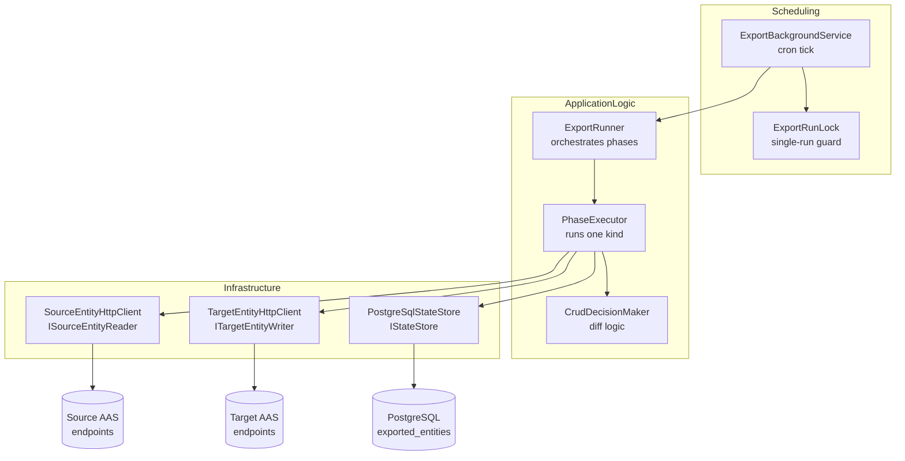
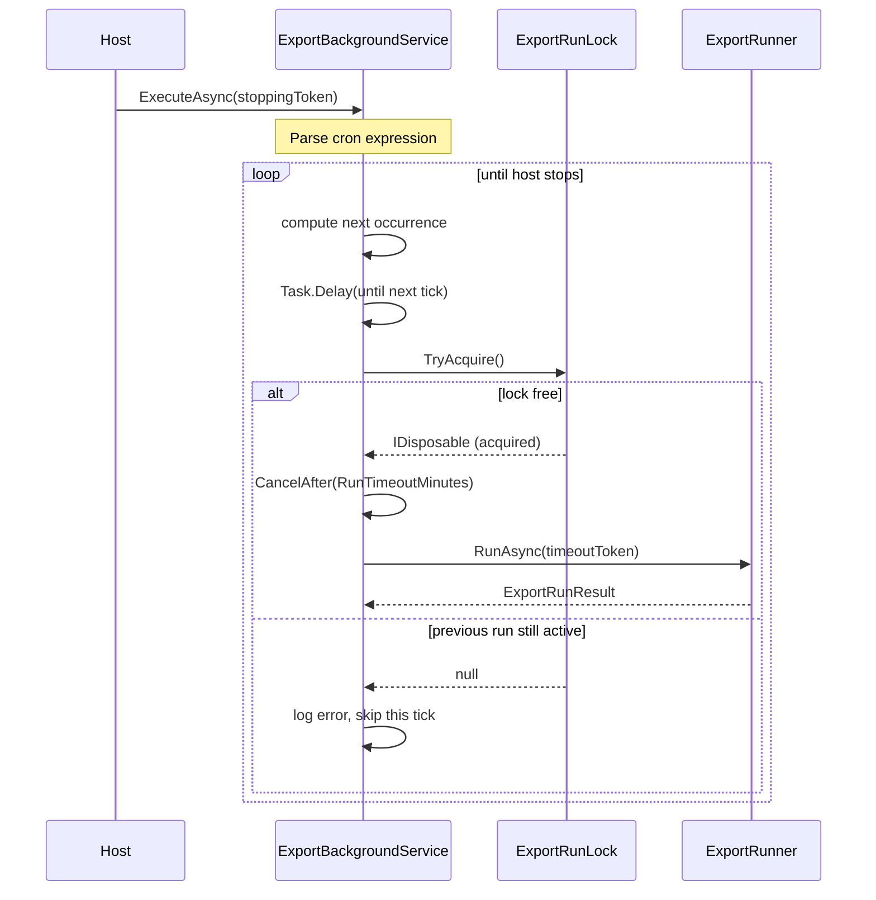
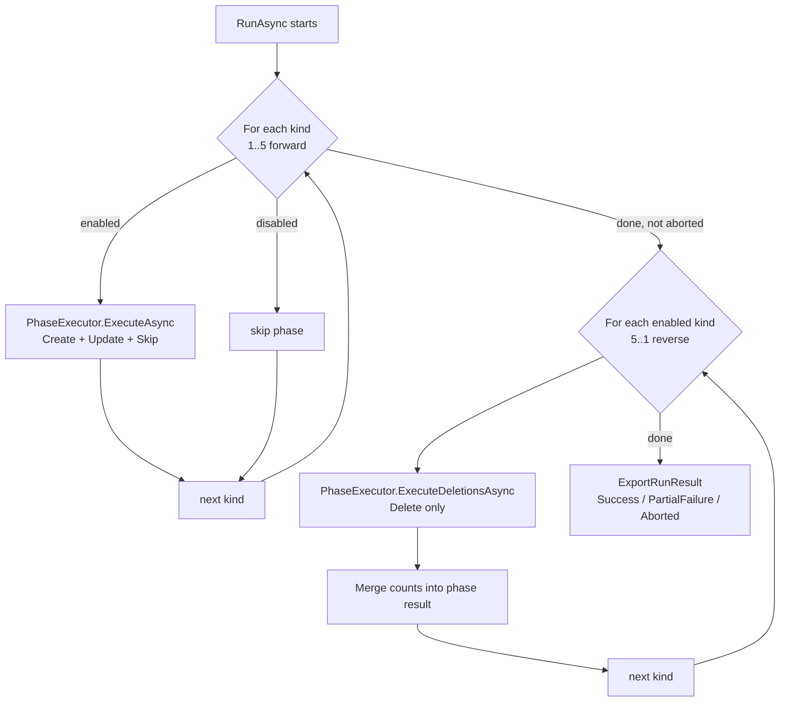
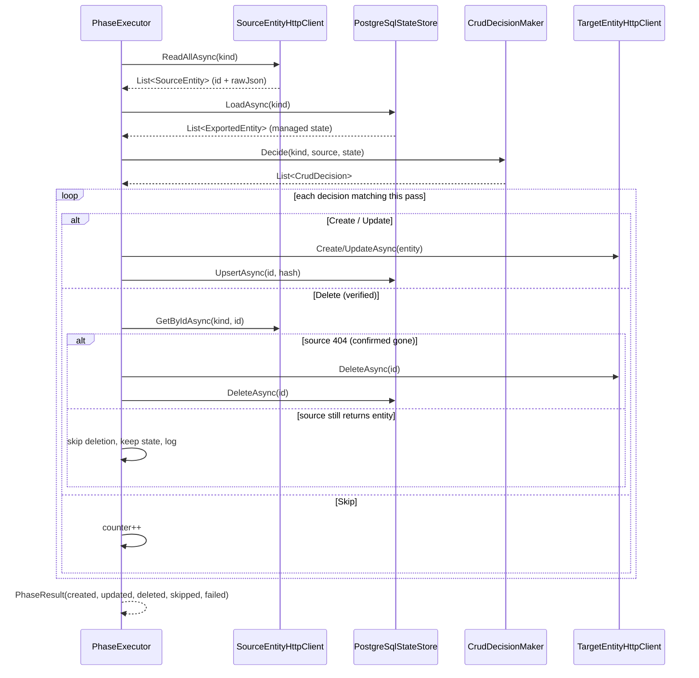
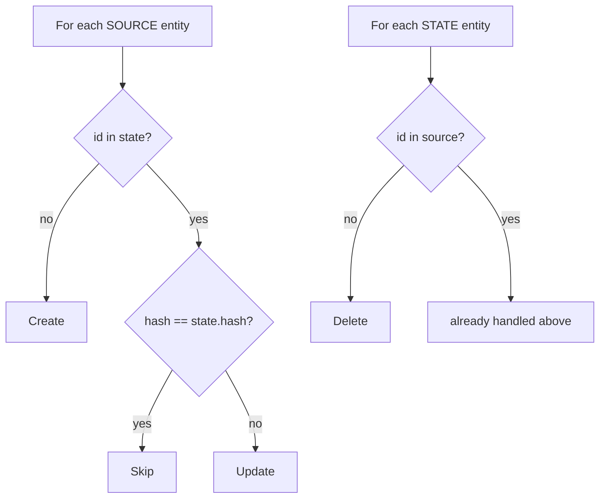
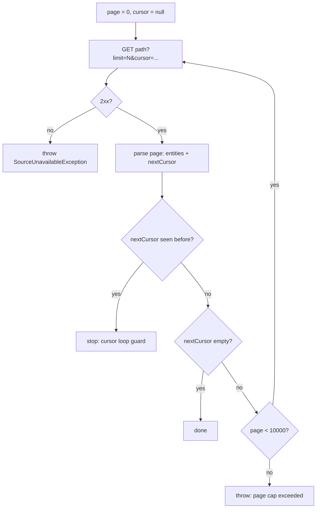
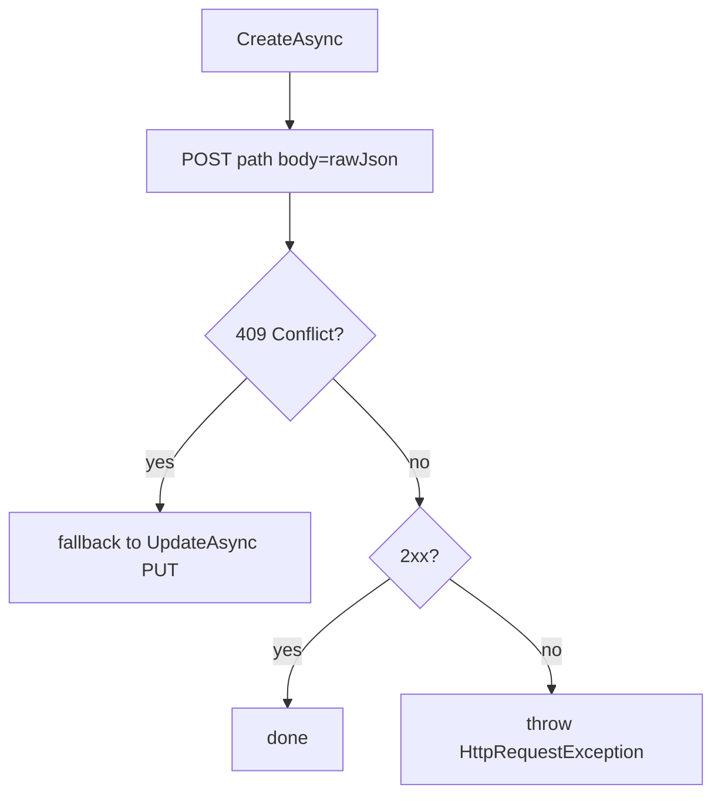
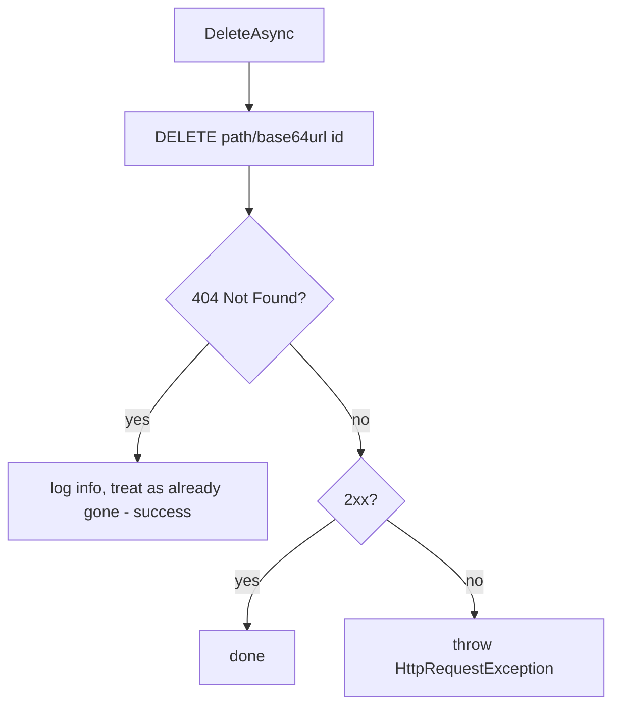
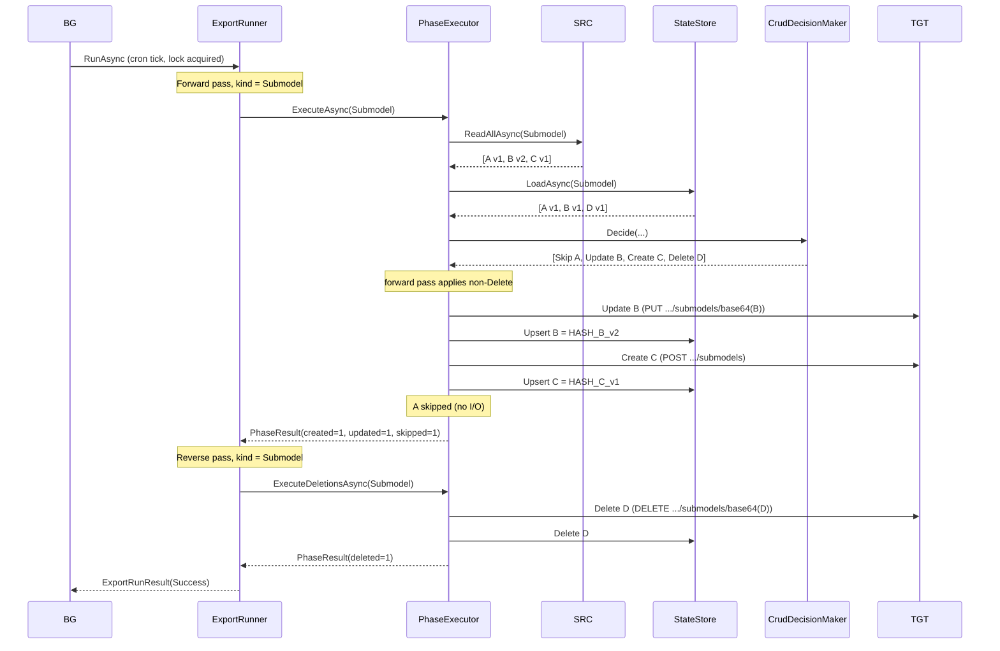

# Export Service — Exporter Flow (Detailed)

This document explains, in detail, how the **AAS.TwinEngine Export Service** works end to end: the
scheduling, the per‑kind phases, the CRUD decision logic, the HTTP read/write operations, and the
state store. Every operation is described with a concrete example and diagrams.

---

## 1. What the exporter does

The Export Service is a **one‑way synchronizer**. On a cron schedule it:

1. **Reads** all entities of each kind from one or more **source** AAS endpoints.
2. **Compares** them against its own **state store** (an ownership ledger in PostgreSQL).
3. **Decides** what changed: Create / Update / Delete / Skip.
4. **Writes** those changes to the configured **target** AAS endpoints.
5. **Records** the new state (identifier + content hash) so the next run can diff again.

> Key idea: the service only ever updates/deletes entities **it created itself**. The state store is
> the proof of ownership. Anything in the source that the service has never seen is a **Create**;
> anything the service created but is no longer in the source is a **Delete**.

### Entity kinds and order

Defined in [DomainModel/EntityKind.cs](DomainModel/EntityKind.cs). The enum order is **dependency‑first**:

| Order | `EntityKind`        | Why this order |
|-------|---------------------|----------------|
| 1     | `ConceptDescription`| Referenced by submodels |
| 2     | `Submodel`          | Referenced by shells & descriptors |
| 3     | `SubmodelDescriptor`| Registry entry for a submodel |
| 4     | `Shell`             | References submodels |
| 5     | `ShellDescriptor`   | Registry entry for a shell |

Creates/updates run **forward** (1 → 5) so dependencies exist before the things that reference them.
Deletes run **in reverse** (5 → 1) so referencing entities are removed before their dependencies.

---

## 2. High‑level architecture



| Layer | Component | File |
|-------|-----------|------|
| Scheduling | `ExportBackgroundService` | [Infrastructure/Scheduling/ExportBackgroundService.cs](Infrastructure/Scheduling/ExportBackgroundService.cs) |
| Scheduling | `ExportRunLock` | [Infrastructure/Scheduling/ExportRunLock.cs](Infrastructure/Scheduling/ExportRunLock.cs) |
| App logic | `ExportRunner` | [ApplicationLogic/Services/Export/ExportRunner.cs](ApplicationLogic/Services/Export/ExportRunner.cs) |
| App logic | `PhaseExecutor` | [ApplicationLogic/Services/Export/PhaseExecutor.cs](ApplicationLogic/Services/Export/PhaseExecutor.cs) |
| App logic | `CrudDecisionMaker` | [ApplicationLogic/Services/Crud/CrudDecisionMaker.cs](ApplicationLogic/Services/Crud/CrudDecisionMaker.cs) |
| Infra | `SourceEntityHttpClient` | [Infrastructure/Http/Clients/SourceEntityHttpClient.cs](Infrastructure/Http/Clients/SourceEntityHttpClient.cs) |
| Infra | `TargetEntityHttpClient` | [Infrastructure/Http/Clients/TargetEntityHttpClient.cs](Infrastructure/Http/Clients/TargetEntityHttpClient.cs) |
| Infra | `PostgreSqlStateStore` | [Infrastructure/State/DataAccess/PostgreSqlStateStore.cs](Infrastructure/State/DataAccess/PostgreSqlStateStore.cs) |

---

## 3. Scheduling: when a run starts

`ExportBackgroundService` is an ASP.NET Core `BackgroundService`. See
[ExportBackgroundService.cs](Infrastructure/Scheduling/ExportBackgroundService.cs).

### Flow



### Rules

- **Cron** is parsed with [Cronos](https://github.com/HangfireIO/Cronos) (5‑field format). Example
  config `*/5 * * * *` = every 5 minutes.
- **Disabled scheduler** (`Scheduler.Enabled = false`) → logs a warning and never runs.
- **Invalid cron** → logs critical and the scheduler exits (service stays up but idle).
- **Overlap protection**: `ExportRunLock.TryAcquire()` uses `Interlocked.CompareExchange`. If a run is
  still in progress when the next tick fires, the tick is **skipped** with an error log — runs never
  overlap.
- **Timeout**: each run gets a linked `CancellationTokenSource` that cancels after
  `RunTimeoutMinutes`. A run exceeding it is cancelled and logged as critical.

**Example config** ([appsettings.json](appsettings.json)):

```json
"Scheduler": {
  "Enabled": true,
  "CronExpression": "*/5 * * * *",
  "RunTimeoutMinutes": 30
}
```

---

## 4. The run: `ExportRunner`

`ExportRunner.RunAsync` ([ExportRunner.cs](ApplicationLogic/Services/Export/ExportRunner.cs))
orchestrates a full cycle in two passes.



### Two‑pass design

1. **Forward pass** (ConceptDescription → ShellDescriptor): applies **Create** and **Update**
   (everything except Delete). Dependencies are created first.
2. **Reverse pass** (ShellDescriptor → ConceptDescription): applies **Delete** only. Referencing
   entities are deleted before their dependencies, preserving referential integrity.

The per‑phase counts from both passes are combined with `Merge` into a single `PhaseResult` per kind.

### Phase enablement

A phase runs only if **both** the source and target for that kind are enabled
(`IsPhaseEnabled`):

```csharp
EntityKind.Submodel => sources.Submodels.Enabled && targets.Submodels.Enabled,
```

So in the shipped [appsettings.json](appsettings.json), only `Submodel` has both source and target
enabled — it is the only phase that actually syncs; the rest are skipped.

### Run status outcomes

Defined in [DomainModel/ExportRunResult.cs](DomainModel/ExportRunResult.cs):

| Status           | When |
|------------------|------|
| `Success`        | Every applied operation succeeded. |
| `PartialFailure` | Some individual entities failed, but phases completed. |
| `Aborted`        | A `SourceUnavailableException` or unexpected exception stopped the run early. Remaining phases are cancelled to avoid partial/inconsistent target state. |

**Abort behavior:** if any forward phase throws `SourceUnavailableException`, the run sets status
`Aborted` and **breaks** immediately — it does **not** run deletions. This prevents deleting target
entities just because a source was temporarily unreachable (which would otherwise look like "the
source no longer has these entities").

---

## 5. A single phase: `PhaseExecutor`

One phase = sync one `EntityKind`. See
[PhaseExecutor.cs](ApplicationLogic/Services/Export/PhaseExecutor.cs).



### Steps

1. **Fetch source** — `ISourceEntityReader.ReadAllAsync(kind)` returns every source entity as
   `SourceEntity(Identifier, RawJson)`.
2. **Load state** — `IStateStore.LoadAsync(kind)` returns the `ExportedEntity` ledger rows this
   service owns for that kind.
3. **Decide** — `ICrudDecisionMaker.Decide(...)` diffs source vs. state into a list of
   `CrudDecision`.
4. **Apply** — for each decision in the current pass (forward pass applies non‑Delete; reverse pass
   applies only Delete), call the target writer and update the state store. **Delete decisions are
   verified first** via `ISourceEntityReader.GetByIdAsync(kind, id)` — the target delete runs only
   when the source confirms the entity is gone (see §8a).

### Pass filtering

The same private `ExecuteAsync` is reused with a predicate:

```csharp
public Task<PhaseResult> ExecuteAsync(...) =>
    ExecuteAsync(kind, d => d.Operation != ExportOperation.Delete, ct);   // forward pass

public Task<PhaseResult> ExecuteDeletionsAsync(...) =>
    ExecuteAsync(kind, d => d.Operation == ExportOperation.Delete, ct);   // reverse pass
```

### Per‑entity error isolation

Each entity is applied in its own `try/catch`. A failure increments `failed` and is logged, but the
loop **continues** with the rest. One bad entity never fails the whole phase.
`OperationCanceledException` is re‑thrown (cancellation/timeout must propagate).

### Bounded parallelism

Within a phase, entities are independent (distinct identifiers), so they are applied concurrently via
`Parallel.ForEachAsync` with `MaxDegreeOfParallelism` from
[PerformanceConfig](ServiceConfiguration/Config/PerformanceConfig.cs) (default **8**). This cuts the
wall‑clock time of large runs, where the bottleneck is sequential HTTP round‑trips. Counters are
updated with `Interlocked`, per‑entity error isolation is preserved, and cancellation still
propagates out of the parallel loop. Set `Performance.MaxDegreeOfParallelism = 1` for fully
sequential behavior. Dependency ordering is unaffected — parallelism is **within** a phase only;
`ExportRunner` still runs phases strictly forward (create/update) then reverse (delete).

```json
"Performance": {
  "MaxDegreeOfParallelism": 8
}
```

---

## 6. The diff: `CrudDecisionMaker`

The heart of the sync. See
[CrudDecisionMaker.cs](ApplicationLogic/Services/Crud/CrudDecisionMaker.cs).

Inputs:
- `sourceEntities` — current truth from the source.
- `managedState` — what this service created before (identifier + `ContentHash`).

### Decision table

| Condition | Operation |
|-----------|-----------|
| Source id **not** in state | `Create` |
| Source id in state **and** hashes equal | `Skip` (unchanged) |
| Source id in state **and** hashes differ | `Update` |
| State id **not** in source | `Delete` |



### Content hash

`SourceEntity.ContentHash` ([DomainModel/SourceEntity.cs](DomainModel/SourceEntity.cs)) is
`SHA‑256` over the raw JSON, hex‑encoded:

```csharp
public string ContentHash => Convert.ToHexString(SHA256.HashData(Encoding.UTF8.GetBytes(RawJson)));
```

The exact same bytes that were last written are hashed and stored in the ledger, so an unchanged
entity hashes identically → `Skip`. Any byte change → `Update`.

### Worked example

Suppose the **source** currently returns submodels `A`, `B`, `C`, and the **state store** holds
`A`, `B`, `D` from the previous run:

| id | In source? | In state? | Hash match? | Decision |
|----|-----------|-----------|-------------|----------|
| A  | yes       | yes       | yes         | **Skip** |
| B  | yes       | yes       | no          | **Update** |
| C  | yes       | no        | —           | **Create** |
| D  | no        | yes       | —           | **Delete** |

Resulting `List<CrudDecision>`:

```
[ Skip   Submodel A,
  Update Submodel B,
  Create Submodel C,
  Delete Submodel D ]
```

On the forward pass: C is created, B is updated, A is skipped.
On the reverse pass: D is deleted.

---

## 7. Reading from the source: `SourceEntityHttpClient`

See [SourceEntityHttpClient.cs](Infrastructure/Http/Clients/SourceEntityHttpClient.cs).
Implements `ISourceEntityReader.ReadAllAsync(kind)`.

### Responsibilities

- Resolve the named `HttpClient` and endpoint for the kind via `EndpointResolver`.
- If the endpoint is **disabled** → return an empty list (no‑op, not an error).
- If the path is **missing** → throw `SourceUnavailableException`.
- **Page** through results following cursors until exhausted.
- Parse each element into `SourceEntity(identifier, rawJson)`.

### Pagination

Two response shapes are supported:

1. **Plain array:** `[ {...}, {...} ]`
2. **Paged wrapper:**
   ```json
   {
     "paging_metadata": { "cursor": "abc123" },
     "result": [ {...}, {...} ]
   }
   ```

Request URI is built as `{Path}?limit={Limit}` and, on subsequent pages,
`&cursor={urlEncodedCursor}`.



### Safety guards

- **Cursor loop guard**: if the source returns a cursor already seen, reading stops with a warning
  (prevents infinite loops from a broken source).
- **Page cap**: `MaxPagesPerRead = 10_000`. Exceeding it throws `SourceUnavailableException`.

### Identifier extraction

`ExtractIdentifier` looks for:
1. `element.id` (string), or
2. `element.identification.id` (string, legacy shape).

Missing id → `SourceUnavailableException("Source entity is missing its 'id' property.")`.

### Example

Config for submodels source:

```json
"Submodels": {
  "BaseUrl": "http://localhost:8085",
  "Path": "/submodels",
  "Limit": 250,
  "Enabled": true
}
```

Request sequence for a paged source:

```
GET http://localhost:8085/submodels?limit=250
  → { "result": [ {id:"A"}, {id:"B"} ], "paging_metadata": { "cursor": "c1" } }
GET http://localhost:8085/submodels?limit=250&cursor=c1
  → { "result": [ {id:"C"} ], "paging_metadata": { } }   // no cursor → done
```

Result: `[ SourceEntity("A",...), SourceEntity("B",...), SourceEntity("C",...) ]`.

---

## 8. Writing to the target: `TargetEntityHttpClient`

See [TargetEntityHttpClient.cs](Infrastructure/Http/Clients/TargetEntityHttpClient.cs).
Implements `ITargetEntityWriter`.

The item URL is `{Path}/{Base64URL(identifier)}` per the IDTA specification
([Base64Url.cs](Infrastructure/Http/Clients/Base64Url.cs) — standard Base64 with `+→-`, `/→_`, no
padding).

### Create (POST)



- `POST {Path}` with the raw JSON body.
- **409 Conflict** → the entity already exists on the target → automatically falls back to
  `UpdateAsync` (PUT). This makes creation idempotent against a target that already has the entity.
- Any other non‑2xx → `HttpRequestException`.

**Example** — create submodel `https://acme.com/sm/1`:

```
POST http://localhost:8081/submodels
Content-Type: application/json

{ "id": "https://acme.com/sm/1", ... }        // verbatim source JSON
```

### Update (PUT)

```
PUT http://localhost:8081/submodels/aHR0cHM6Ly9hY21lLmNvbS9zbS8x
Content-Type: application/json

{ "id": "https://acme.com/sm/1", ... }
```

The identifier `https://acme.com/sm/1` is Base64URL‑encoded into the path segment. Non‑2xx →
`HttpRequestException`.

### Delete (DELETE)



- `DELETE {Path}/{Base64URL(id)}`.
- **404 Not Found** → treated as success ("already gone"). Delete is idempotent.
- Any other non‑2xx → `HttpRequestException`.

**Example:**

```
DELETE http://localhost:8081/submodels/aHR0cHM6Ly9hY21lLmNvbS9zbS8x
```

### Raw JSON is forwarded verbatim

The service never transforms payloads. Whatever JSON the source returned for an entity is exactly
what is POST/PUT to the target. This keeps the exporter format‑agnostic.

---

## 8a. Deletion verification: source GET‑by‑ID

A `Delete` decision means the entity is **absent from the paginated source read** but still present
in the ownership ledger. Before any entity is removed from the target, the exporter **double‑checks
with the source directly** using a GET‑by‑ID call. This is a safety net against accidental deletion
caused by an incomplete/inconsistent paginated read.

The verification lives in `PhaseExecutor.ApplyDeletionAsync`
([PhaseExecutor.cs](ApplicationLogic/Services/Export/PhaseExecutor.cs)) and calls
`ISourceEntityReader.GetByIdAsync(kind, identifier)`, implemented by
[SourceEntityHttpClient.cs](Infrastructure/Http/Clients/SourceEntityHttpClient.cs).

```mermaid
flowchart TD
    A[Delete candidate<br/>in state, not in paged read] --> B[GET source /{path}/base64url id]
    B --> C{result}
    C -->|404 Not Found<br/>returns null| D[Confirmed deleted]
    D --> E[DELETE target]
    E --> F[DELETE state]
    F --> G[count as Deleted]
    C -->|200 entity returned| H[Still exists → pagination/GET-by-id discrepancy]
    H --> I[Do NOT delete target<br/>Keep state, log warning]
    I --> J[count as Skipped]
    C -->|5xx / timeout / network<br/>SourceUnavailableException| K[Cannot verify]
    K --> L[Do NOT delete target<br/>Keep state, log error]
    L --> M[count as Failed → retried next run]
```

### The three outcomes

| Source GET‑by‑ID result | `GetByIdAsync` returns | Action | Counter |
|-------------------------|------------------------|--------|---------|
| **404 Not Found** | `null` | Delete from target, then delete ownership state | `Deleted` |
| **200 entity present** | the `SourceEntity` | **Skip** deletion, keep state, log the discrepancy | `Skipped` |
| **5xx / timeout / network** | throws `SourceUnavailableException` | **Skip** deletion, keep state, log, retry on a future run | `Failed` |

- The item URL uses the same IDTA Base64URL item‑path convention as the target writer:
  `GET {SourcePath}/{Base64URL(identifier)}`.
- State is only ever removed **after** a successful target delete that was itself gated on a
  confirmed 404 from the source — so the ownership ledger can never lose a record for an entity that
  still exists at the source.
- A transient GET‑by‑ID failure is isolated per entity (counted as `Failed`); other deletion
  candidates in the same phase are still verified independently.

### Why not compare against the whole target?

Deletions are **never** derived by listing the target repository. The target can contain records
owned by other systems. The only inputs to a deletion are:

1. the exporter's PostgreSQL **ownership ledger** (what this exporter created),
2. the **completed** paginated source read (what still exists), and
3. the source **GET‑by‑ID** confirmation (final safety check).

If the source read did not complete (any page failed → `SourceUnavailableException`), the run is
aborted before the deletion pass, so no deletion verification or deletion happens at all.

**Example** — candidate `https://acme.com/sm/C` is in state but missing from the paged read:

```
GET http://localhost:8085/submodels/aHR0cHM6Ly9hY21lLmNvbS9zbS9D
  → 404 Not Found                      ⇒ confirmed deleted
DELETE http://localhost:8081/submodels/aHR0cHM6Ly9hY21lLmNvbS9zbS9D
  → 204                                ⇒ removed from target
(state row for C removed)
```

If instead the source returned `200` with the entity body, the exporter logs a warning and leaves
both the target and the ledger untouched.

---

## 9. The state store: `PostgreSqlStateStore`

The ownership ledger. See
[PostgreSqlStateStore.cs](Infrastructure/State/DataAccess/PostgreSqlStateStore.cs) and the SQL in
[StateStoreQueries.cs](Infrastructure/State/DataAccess/StateStoreQueries.cs).

### Table

```sql
CREATE TABLE {schema}.exported_entities (
    entity_kind      VARCHAR(50)   NOT NULL,
    identifier       TEXT          NOT NULL,
    content_hash     CHAR(64)      NOT NULL,
    created_at       TIMESTAMPTZ   NOT NULL DEFAULT NOW(),
    last_synced_at   TIMESTAMPTZ   NOT NULL DEFAULT NOW(),
    CONSTRAINT pk_exported_entities PRIMARY KEY (entity_kind, identifier)
);
CREATE INDEX idx_exported_entities_kind ON {schema}.exported_entities (entity_kind);
```

- Primary key is `(entity_kind, identifier)` — one row per managed entity per kind.
- `content_hash` is the SHA‑256 hex of the last synced payload (64 chars).
- Schema name is **whitelist‑validated** (`QuoteSchema`): only letters, digits, underscore — the
  only part of the query that is string‑formatted (identifiers can't be SQL parameters). All values
  are passed as parameters, so there's no injection surface.

### Operations

| Method | SQL | Called by |
|--------|-----|-----------|
| `EnsureSchemaAsync` | `CREATE SCHEMA/TABLE IF NOT EXISTS` | startup |
| `LoadAsync(kind)` | `SELECT ... WHERE entity_kind=@k` | start of each phase |
| `UpsertAsync(entity)` | `INSERT ... ON CONFLICT DO UPDATE` | after a Create/Update |
| `DeleteAsync(kind,id)` | `DELETE ... WHERE kind=@k AND id=@i` | after a Delete |

### Upsert semantics

```sql
INSERT INTO {schema}.exported_entities (entity_kind, identifier, content_hash, created_at, last_synced_at)
VALUES (@entity_kind, @identifier, @content_hash, @created_at, @last_synced_at)
ON CONFLICT (entity_kind, identifier) DO UPDATE SET
    content_hash   = EXCLUDED.content_hash,
    last_synced_at = EXCLUDED.last_synced_at;
```

On insert, `created_at` is set; on update, only `content_hash` and `last_synced_at` change —
`created_at` is preserved.

### State transitions tied to target writes

In `PhaseExecutor.ApplyAsync`, the state store is updated **only after** the matching target write
succeeds:

| Operation | Target call | Then state store |
|-----------|-------------|------------------|
| Create | `CreateAsync` | `UpsertAsync(id, hash now)` |
| Update | `UpdateAsync` | `UpsertAsync(id, hash now)` |
| Delete | `DeleteAsync` | `DeleteAsync(id)` |

If the target write throws, the state store is **not** touched, so the entity will be retried on the
next run. (The content is only recorded once it is actually on the target.)

---

## 10. End‑to‑end worked example

**Setup:** only the `Submodel` phase is enabled (both source and target).
Previous state ledger for `Submodel`:

```
identifier                 content_hash
https://acme.com/sm/A      HASH_A_v1
https://acme.com/sm/B      HASH_B_v1
https://acme.com/sm/D      HASH_D_v1
```

**This run, source returns:**

```
A  (unchanged)      → hash HASH_A_v1
B  (edited)         → hash HASH_B_v2
C  (new)            → hash HASH_C_v1
```

### Step by step



### Result

- Target now has `A` (unchanged), `B` (updated), `C` (created), and `D` removed.
- Ledger now:

```
identifier                 content_hash
https://acme.com/sm/A      HASH_A_v1
https://acme.com/sm/B      HASH_B_v2
https://acme.com/sm/C      HASH_C_v1
```

- `ExportRunResult.Status = Success`; phase counts `Created=1, Updated=1, Deleted=1, Skipped=1,
  Failed=0`.

---

## 11. Error handling & resilience summary

| Scenario | Where handled | Behavior |
|----------|---------------|----------|
| Previous run still active | `ExportBackgroundService.TickAsync` | Skip tick, log error |
| Run exceeds timeout | `ExportBackgroundService` | Cancel run, log critical |
| Source endpoint disabled | `SourceEntityHttpClient` | Return empty list (no‑op) |
| Source unreachable / non‑2xx | `SourceEntityHttpClient` | Throw `SourceUnavailableException` → phase **aborts the run**, deletions skipped |
| Source cursor loop | `SourceEntityHttpClient` | Stop reading, log warning |
| Delete candidate, source GET‑by‑ID 404 | `PhaseExecutor.ApplyDeletionAsync` | Confirmed gone → delete target + state (counted `Deleted`) |
| Delete candidate, source GET‑by‑ID 200 | `PhaseExecutor.ApplyDeletionAsync` | Still exists → skip delete, keep state, log warning (counted `Skipped`) |
| Delete candidate, source GET‑by‑ID 5xx/timeout | `SourceEntityHttpClient.GetByIdAsync` | Throw `SourceUnavailableException` → skip delete, keep state, retried next run (counted `Failed`) |
| Target POST 409 Conflict | `TargetEntityHttpClient.CreateAsync` | Fall back to PUT (update) |
| Target DELETE 404 | `TargetEntityHttpClient.DeleteAsync` | Treat as already gone (success) |
| Target other non‑2xx | `TargetEntityHttpClient` | Throw `HttpRequestException` → counted as a per‑entity failure, phase continues |
| Single entity write fails | `PhaseExecutor` | `failed++`, log error, continue with next entity |
| Any phase unexpected error | `ExportRunner` | Status `Aborted`, cancel remaining phases |
| Cancellation / host stopping | all layers | `OperationCanceledException` propagates up |

Retries/backoff for transient HTTP failures are configured per the `Resilience` section
([ResilienceConfig](ServiceConfiguration/Config/ResilienceConfig.cs),
[ResilienceHandlerExtensions](Infrastructure/Http/Policies/ResilienceHandlerExtensions.cs)) and
applied on the named HTTP clients.

---

## 12. Configuration reference

Root section `ExportService` ([ExportServiceConfig.cs](ServiceConfiguration/Config/ExportServiceConfig.cs)):

| Sub‑section | Purpose |
|-------------|---------|
| `Scheduler` | Cron, enable flag, run timeout |
| `Resilience`| Retry attempts, backoff |
| `Performance` | `MaxDegreeOfParallelism` — concurrent entity applies per phase (default 8) |
| `StateStore`| PostgreSQL connection string + schema |
| `Sources`   | Per‑kind source endpoint (BaseUrl, Path, Limit, Enabled, Auth) |
| `Targets`   | Per‑kind target endpoint (BaseUrl, Path, Enabled, Auth) |
| `Observability` | OTLP endpoint, service name/version |

Each endpoint supports `Auth` (`None` or bearer token via
[BearerTokenHandler](Infrastructure/Http/Authorization/BearerTokenHandler.cs) /
[ConfiguredTokenProvider](Infrastructure/Http/Authorization/ConfiguredTokenProvider.cs)).

A phase is active only when **both** its source and target are `Enabled: true`.

---

## 13. Observability

Every stage opens a tracing span (`ExportServiceTracing`):

| Span | Covers |
|------|--------|
| `ExportRun` | the whole run |
| `ExportPhase` | one kind (tagged with `EntityKind`) |
| `FetchSourceEntities` | source read |
| `DecideCrudOperations` | diff |
| `WriteEntityToTarget` | each target write (tagged kind, id, operation) |
| `VerifyDeletionCandidate` | each source GET‑by‑ID deletion check (tagged kind, id) |

Phase spans are tagged with final `Created/Updated/Deleted/Skipped/Failed` counts, and structured
logs are emitted at run start/finish and per phase. Health is exposed at `/healthz`
([Program.cs](Program.cs)).
